# Nizaam Core

> Shared, domain-agnostic Rust foundation for the Nizaam Islamic Ecosystem.

Nizaam Core is the common platform layer used by Nizaam domain and infrastructure engines. It provides the contracts, identities, execution infrastructure, transport abstractions, security boundary, observability, artifacts, retry/idempotency mechanisms, internal events, and Control Plane needed for engines to communicate and execute safely.

Core intentionally does **not** contain domain meaning such as Quran, Hadith, Arabic, search, Fiqh, or other engine-specific business logic.

---

## Table of Contents

- [Nizaam Core](#nizaam-core)
  - [Table of Contents](#table-of-contents)
  - [Overview](#overview)
  - [Design Goals](#design-goals)
  - [Architecture](#architecture)
  - [Core Responsibilities](#core-responsibilities)
  - [Request and Execution Flow](#request-and-execution-flow)
  - [Control Plane](#control-plane)
    - [What the Control Plane does](#what-the-control-plane-does)
    - [What the Control Plane does not do](#what-the-control-plane-does-not-do)
      - [Registration, Registry, and Membership](#registration-registry-and-membership)
      - [Engine and Instance Identity](#engine-and-instance-identity)
      - [Destination semantics](#destination-semantics)
      - [Routing](#routing)
  - [Universal Contracts](#universal-contracts)
    - [Contract versions](#contract-versions)
  - [Identity Model](#identity-model)
  - [Transport and Message Framing](#transport-and-message-framing)
    - [Message framing](#message-framing)
      - [Header fields](#header-fields)
      - [Current framing limits](#current-framing-limits)
      - [Frame integrity](#frame-integrity)
  - [Runtime and Lifecycle](#runtime-and-lifecycle)
    - [Engine context](#engine-context)
  - [Middleware and Security](#middleware-and-security)
  - [Capabilities](#capabilities)
  - [Retry and Idempotency](#retry-and-idempotency)
  - [Retry](#retry)
    - [Idempotency](#idempotency)
  - [Streaming](#streaming)
  - [Artifacts and Provenance](#artifacts-and-provenance)
  - [Events](#events)
  - [Observability](#observability)
  - [Configuration](#configuration)
  - [Health and Readiness](#health-and-readiness)
  - [Error and Logging Systems](#error-and-logging-systems)
    - [Error System](#error-system)
    - [Logging System](#logging-system)
  - [Project Structure](#project-structure)
  - [Testing](#testing)
  - [Architecture Principles](#architecture-principles)
    - [1. Core stays domain agnostic](#1-core-stays-domain-agnostic)
    - [2. One responsibility per subsystem](#2-one-responsibility-per-subsystem)
    - [3. Do not create duplicate infrastructure](#3-do-not-create-duplicate-infrastructure)
    - [4. Keep identities distinct](#4-keep-identities-distinct)
    - [5. Preserve immutable decisions](#5-preserve-immutable-decisions)
    - [6. Keep planning separate from execution](#6-keep-planning-separate-from-execution)
    - [7. Prefer deterministic behavior](#7-prefer-deterministic-behavior)
    - [8. Keep tests close to the public contract](#8-keep-tests-close-to-the-public-contract)
    - [9. Fail explicitly](#9-fail-explicitly)
  - [End-to-End Architecture View](#end-to-end-architecture-view)
  - [Compatibility and Evolution](#compatibility-and-evolution)
  - [Current Status](#current-status)
  - [Getting Started](#getting-started)
    - [Requirements](#requirements)
    - [Build](#build)
    - [Run the test suite](#run-the-test-suite)
    - [Run tests without changing the working tree](#run-tests-without-changing-the-working-tree)
    - [Check the project](#check-the-project)
  - [Development Guidelines](#development-guidelines)
  - [License](#license)

---

## Overview

Nizaam is designed as an ecosystem of independent engines rather than one large application.

A domain engine owns its domain semantics. Core supplies the shared infrastructure required for those engines to communicate, execute, observe, and coordinate consistently.

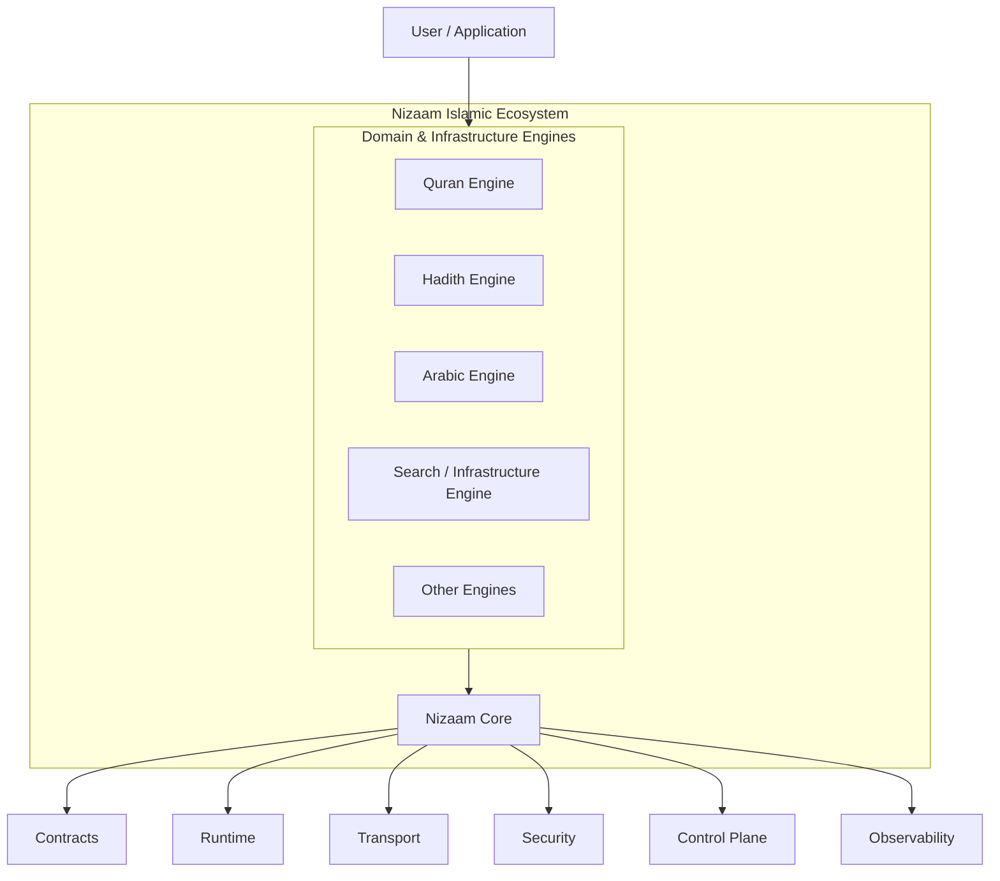

The important boundary is:

> **Engines own meaning. Core owns shared mechanisms.**

For example, Core can provide a capability named `quran.search` as an identifier and routing mechanism, but it does not implement what Quran search means. The Quran engine owns that behavior.

---

## Design Goals

Nizaam Core is designed around a few simple goals:

- **Domain agnostic** — no engine-specific business logic in Core.
- **Explicit contracts** — communication uses validated, versioned contracts.
- **Distinct identities** — operation, attempt, message, engine, event, artifact, and other identifiers remain separate.
- **Deterministic coordination** — important decisions should be reproducible from their inputs.
- **Clear ownership** — every subsystem has a defined responsibility.
- **Composable infrastructure** — transport, runtime, retry, security, events, and other systems remain separate mechanisms.
- **Safe lifecycle handling** — engines, tasks, attempts, streams, publishers, and events have explicit lifecycle states.
- **Bounded resources** — queues, concurrency, streaming, delivery, and retry mechanisms enforce limits.
- **Provider neutrality** — Core defines interfaces and mechanisms without forcing external infrastructure providers.
- **Stable decisions** — once a routing decision or other execution decision is created, later state changes do not silently rewrite it.

---

## Architecture

At a high level, Core can be viewed as several layers.

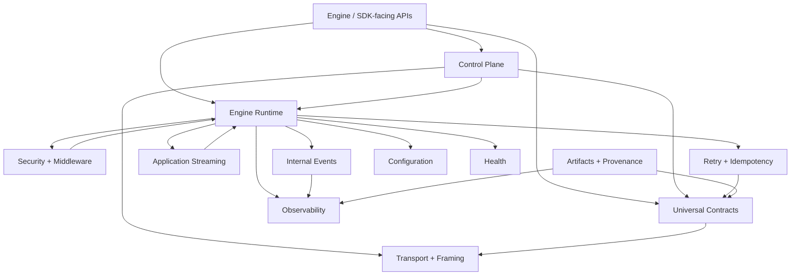

These are mechanisms, not separate applications. They compose through explicit types and boundaries.

---

## Core Responsibilities

The implementation is organized into the following major areas.

| Area | Responsibility |
| --- | --- |
| `identity` | Strongly typed Core identifiers |
| `operation` | Logical operation identity, deadlines, cancellation, and operation context |
| `contracts` | Universal messages, descriptors, metadata, envelopes, validation, compatibility |
| `error` | Typed technical error definitions and runtime error occurrences |
| `logging` | Structured logging events and sinks |
| `capability` | Capability definitions, registration, lookup, and dispatch |
| `transport` | Byte-oriented transport abstraction and binary framing |
| `client` | Universal client boundary over transport |
| `server` | Engine server boundary and request dispatch |
| `runtime` | Engine lifecycle, request admission, task management, concurrency, pipelines |
| `middleware` | Deterministic cross-cutting request/response processing |
| `security` | Authentication, authorization, trusted security context |
| `artifact` | Artifact identity, versions, content references, integrity, publication, storage |
| `provenance` | Execution context and artifact relationship records |
| `observability` | Metrics, tracing, correlation, diagnostics, and observability events |
| `health` | Liveness, readiness, capability and dependency health |
| `config` | Environment loading through validated immutable configuration snapshots |
| `streaming` | Application-level logical streams and bounded backpressure |
| `retry` | Retry admission, attempts, policy, budgets, backoff, and jitter |
| `idempotency` | Logical idempotency identities, records, reservations, and state transitions |
| `events` | Internal event creation, subscription, publication, and bounded delivery |
| `control_plane` | Communication-focused coordination from logical requirements to concrete engine instances |

---

## Request and Execution Flow

A typical cross-engine request follows a conceptual path like this:

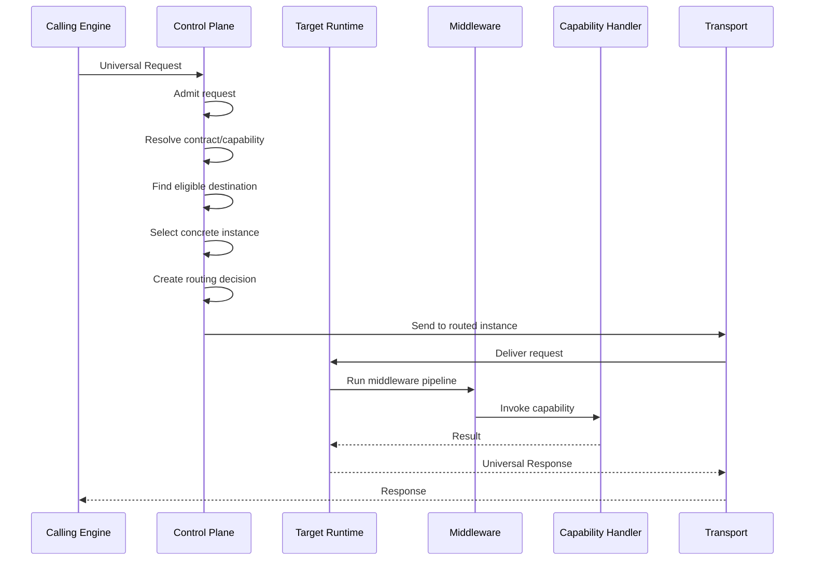

The exact execution path can vary depending on retries, streaming, events, and other mechanisms, but the ownership boundaries remain the same.

---

## Control Plane

The Control Plane is the communication-focused coordination layer introduced in Phase 15.

Its job is to transform a logical communication requirement into a concrete routing decision without becoming a workflow engine.

```mermaid
flowchart LR
    Registration["Engine Registration"]
    Membership["Membership Snapshot"]
    Contract["Contract Resolution"]
    Capability["Capability Resolution"]
    Provider["Provider Resolution"]
    Destination["Destination Semantics"]
    Eligibility["Eligibility"]
    Policy["Routing Policy"]
    Resolution["Resolution"]
    Attempt["Existing Attempt"]
    Decision["Routing Decision"]
    Communication["Communication"]
    Transport["Existing Transport"]

    Registration --> Membership
    Membership --> Contract
    Membership --> Capability
    Contract --> Provider
    Capability --> Provider
    Provider --> Destination
    Membership --> Eligibility
    Destination --> Eligibility
    Eligibility --> Policy
    Policy --> Resolution
    Resolution --> Attempt
    Attempt --> Decision
    Decision --> Communication
    Communication --> Transport
```

### What the Control Plane does

The Control Plane coordinates:

1. **Admission** of a request into the coordination path.
2. **Contract identification and compatibility**.
3. **Capability identification and advertisement checks**.
4. **Provider resolution**.
5. **Destination semantics**.
6. **Membership and eligibility evaluation**.
7. **Deterministic routing policy**.
8. **Declarative planning and dependency validation**.
9. **Resolution of a coherent coordination snapshot**.
10. **Routing of an existing execution attempt**.
11. **Communication through the existing client/transport mechanisms**.
12. **Replanning evaluation when coordination requirements change**.

### What the Control Plane does not do

The Control Plane does **not**:

- execute capabilities;
- implement domain workflows;
- own transport;
- create retry attempts;
- replace the retry subsystem;
- mutate attempt lifecycle;
- own health state;
- own engine lifecycle;
- perform authentication or authorization;
- become a queue or worker system;
- become a second orchestration runtime;
- select domain-specific provider behavior.

This separation keeps coordination independent from execution.

#### Registration, Registry, and Membership

Engine registration describes an engine instance and its advertised capabilities, contracts, endpoint, runtime metadata, and routing metadata.

The implementation deliberately separates:

- **Registry** — registration/discovery records.
- **Membership** — the set of instances eligible to participate in routing.

Membership snapshots are immutable once produced.

#### Engine and Instance Identity

A logical engine and one running instance are different concepts.

```text
EngineId
    │
    ├── EngineInstanceId
    ├── EngineInstanceId
    └── EngineInstanceId
```

Routing targets a concrete `EngineInstanceId`.

#### Destination semantics

The Control Plane distinguishes:

- logical destinations;
- explicit concrete destinations;
- hard destinations;
- preferred destinations.

A hard explicit destination cannot silently fall back to another instance. A preferred destination may fall back when the preferred target is unavailable and fallback is allowed.

#### Routing

Routing policy is stateless and deterministic.

A routing decision contains the identity of the operation and attempt together with the selected concrete destination.

A previously issued routing decision is not rewritten simply because later Control Plane state changes. A new attempt can receive a new routing decision.

---

## Universal Contracts

The `contracts` module defines the common communication model used by engines.

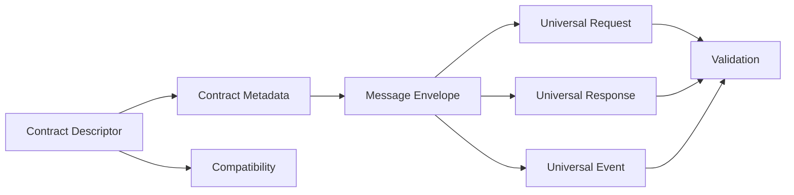

A contract descriptor identifies the contract, capability, version, interaction type, and payload description.

The payload itself remains opaque to Core at the transport/contract boundary. Core validates the structure and metadata around the payload rather than implementing domain-specific payload semantics.

### Contract versions

Versions are explicit and compatibility is evaluated through the canonical contract compatibility layer.

The Core compatibility mechanism is reused by higher-level components rather than creating multiple incompatible compatibility systems.

---

## Identity Model

Nizaam Core intentionally uses different identifiers for different concepts.

Important identities include:

| Identity | Meaning |
| --- | --- |
| `OperationId` | One logical unit of work |
| `AttemptId` | One execution attempt for an operation |
| `MessageId` | One message |
| `CorrelationId` | Correlation across related work |
| `EventId` | One event occurrence |
| `EngineId` | Logical engine identity |
| `EngineInstanceId` | Concrete running engine instance |
| `CapabilityId` | Capability identity |
| `ContractId` | Contract identity |
| `PlanId` | Plan identity |
| `NodeId` | Plan/dependency node identity |
| `ArtifactId` | Artifact identity |
| `EventName` | Internal event name |
| `IdempotencyKey` | Caller-provided repeat-protection key |

These identifiers are deliberately not interchangeable.

For example:

```text
Operation
    │
    ├── Attempt 1 ── Message A
    │
    ├── Attempt 2 ── Message B
    │
    └── Attempt 3 ── Message C
```

A retry creates another `AttemptId` while retaining the same logical `OperationId`.

---

## Transport and Message Framing

The transport layer is provider-neutral.

Core defines the `Transport` abstraction and provides an in-memory implementation for reference/testing purposes. Other concrete transports can implement the same boundary outside Core.

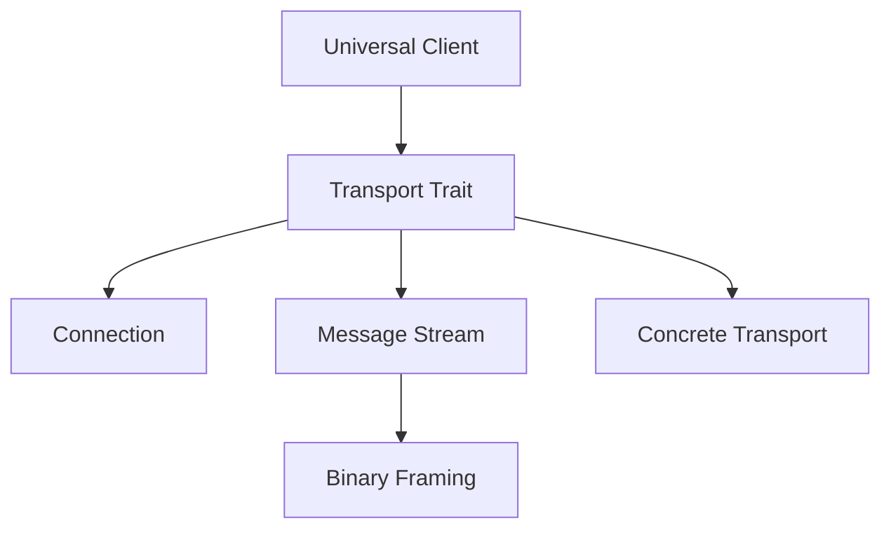

### Message framing

The current framing protocol uses a **fixed 48-byte header**.

```text
48-byte fixed header

0       1       2       4       8              16        20        24
+-------+-------+-------+-------+---------------+---------+---------+
|Version| Flags |Header |Payload| Transport     |Fragment |Cum. ACK |
|       |       |Length |Length | Stream ID     | Index   | Index   |
+-------+-------+-------+-------+---------------+---------+---------+
24                      32                      40                 48
+-----------------------+-----------------------+------------------+
| SACK Bitmap (8 bytes) | XXH3-64 (8 bytes)    | Reserved (8 bytes)|
+-----------------------+-----------------------+------------------+
```

The fields are encoded in big-endian/network byte order.

#### Header fields

| Field | Size | Purpose |
| --- | ---: | --- |
| Version | 1 byte | Framing protocol version |
| Flags | 1 byte | Frame/control semantics |
| Header Length | 2 bytes | Current fixed header length |
| Payload Length | 4 bytes | Payload size in the frame |
| Transport Stream ID | 8 bytes | Transport-level stream identity |
| Fragment Index | 4 bytes | Fragment position |
| Cumulative ACK Index | 4 bytes | Cumulative acknowledgement position |
| SACK Bitmap | 8 bytes | Selective acknowledgement information |
| Checksum | 8 bytes | XXH3-64 checksum |
| Reserved | 8 bytes | Reserved and required to be zero |

#### Current framing limits

- Framing version: `1`
- Header length: `48` bytes
- Maximum complete frame: `20,000,000` bytes
- Maximum payload per frame: `19,999,952` bytes

A logical message larger than the maximum payload is fragmented into multiple frames.

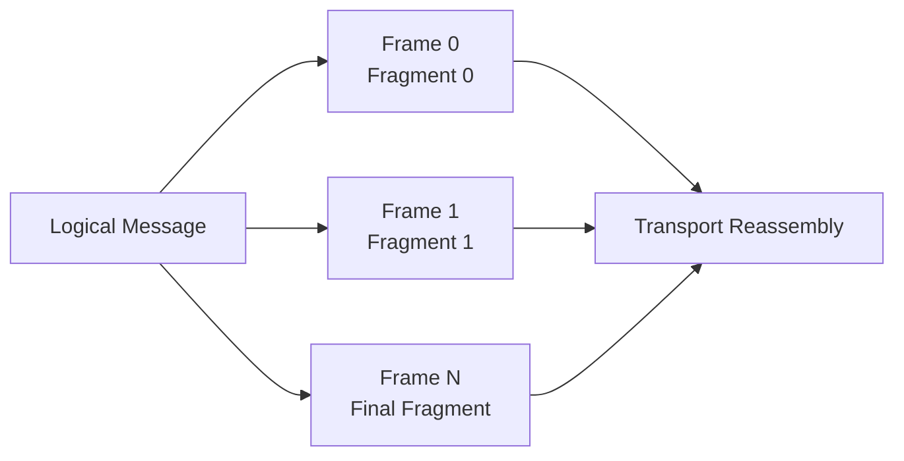

Transport fragmentation is separate from application-level streaming.

#### Frame integrity

Frames use XXH3-64 over the header with the checksum field zeroed, followed by the frame payload.

A receiver validates:

1. header structure;
2. protocol version;
3. flag combinations;
4. payload length;
5. frame length;
6. reserved bytes;
7. checksum.

---

## Runtime and Lifecycle

The runtime provides the common execution foundation for an engine.

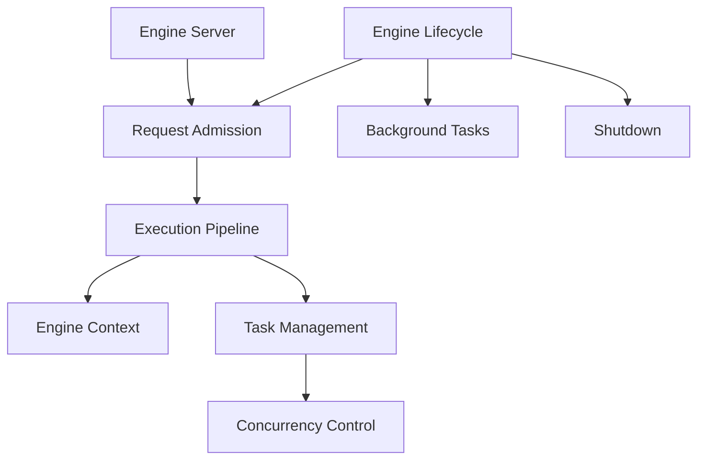

The runtime includes:

- engine lifecycle;
- request admission;
- operation context;
- deadlines;
- cancellation;
- concurrency limits;
- task ownership and lifecycle;
- bounded background task management;
- execution pipelines;
- middleware composition;
- shutdown coordination.

### Engine context

`EngineContext` carries shared execution context such as:

- operation context;
- cancellation;
- deadline;
- security context;
- provenance context;
- immutable configuration snapshot.

Child contexts preserve the relevant trusted context while creating child cancellation scopes.

---

## Middleware and Security

Middleware provides the deterministic cross-cutting processing boundary.

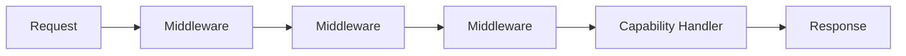

Security is provider-neutral and separated into:

- principal identity;
- authentication;
- security context;
- authorization;
- security middleware integration.

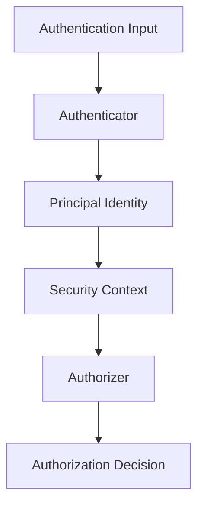

Core does not prescribe provider-specific credentials or domain-specific authorization rules.

---

## Capabilities

A capability represents something an engine can expose through Core's generic mechanism.

The capability subsystem provides:

- capability definitions;
- capability registration;
- capability lookup;
- handler abstraction;
- invocation;
- dispatch;
- capability outcomes and errors.

```text
CapabilityId
     │
     ▼
CapabilityDefinition
     │
     ▼
CapabilityRegistry
     │
     ▼
CapabilityHandler
     │
     ▼
CapabilityOutcome
```

Capability semantics remain engine-owned.

Core knows that a capability exists and can dispatch to its handler; the engine defines what the capability actually does.

---

## Retry and Idempotency

Retry and idempotency are separate but related mechanisms.

## Retry

The retry subsystem owns the safety gates required before another attempt is admitted.

Conceptually:

```mermaid
flowchart LR
    Failure["Attempt Failure"]
    Policy["Retry Policy"]
    Deadline["Deadline / Cancellation"]
    Resource["Resource Admission"]
    Effects["External Effect Safety"]
    Idem["Idempotency / Safe Repeat"]
    Output["Observable Output Safety"]
    Budget["Retry Budget"]
    Backoff["Backoff + Jitter"]
    Attempt["New Attempt"]

    Failure --> Policy
    Policy --> Deadline
    Deadline --> Resource
    Resource --> Effects
    Effects --> Idem
    Idem --> Output
    Output --> Budget
    Budget --> Backoff
    Backoff --> Attempt
```

The retry subsystem does not own routing.

A retry creates a new attempt under the same logical operation:

```text
OperationId = operation-42

AttemptId = attempt-1
AttemptId = attempt-2
AttemptId = attempt-3
```

The Control Plane can independently route each attempt.

### Idempotency

Idempotency is based on a composite identity:

```text
IdempotencyIdentity
    = IdempotencyScope + IdempotencyKey
```

The state store coordinates logical reservations and state transitions.

The Core implementation does not claim to be a distributed idempotency database or retention/reconciliation system.

---

## Streaming

Core contains an application-level streaming subsystem.

It provides:

- logical stream identity;
- stream ownership;
- ordered logical items;
- stream lifecycle;
- bounded backpressure;
- cancellation and deadline propagation;
- a logical consumer boundary.

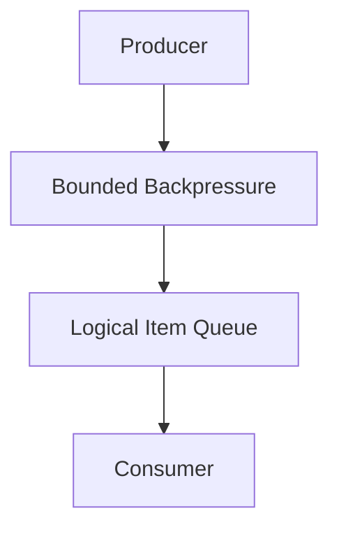

Application streaming is intentionally separate from transport framing:

```text
Application Stream
    │
    │ logical items
    ▼
Transport
    │
    │ byte messages / frames
    ▼
Network
```

A stream item may therefore be carried by one or more transport frames.

---

## Artifacts and Provenance

Artifacts represent externally meaningful content references and versions.

The artifact subsystem covers:

- artifact identity;
- artifact versions;
- content references;
- content digests;
- integrity verification;
- lifecycle;
- publication;
- resolution;
- storage abstraction.

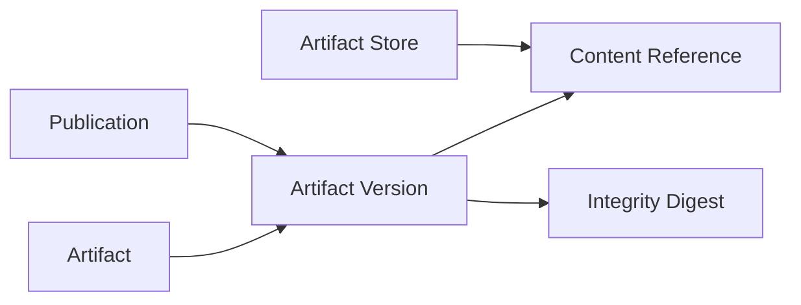

Provenance remains separate from artifact storage.

It provides:

- execution provenance context;
- relationship vocabulary;
- historical provenance records.

This allows Core to carry and record provenance without turning it into a domain-specific workflow system.

---

## Events

The internal Event subsystem provides a generic event mechanism inside Core.

Its responsibilities are separated into:

```text
Event
  ↓
Subscription
  ↓
Publisher
  ↓
Delivery
  ↓
Subscriber
```

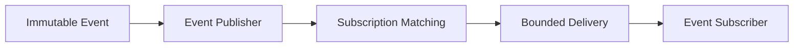

The Event subsystem includes:

- event creation;
- event names and scopes;
- event subscriptions;
- publication;
- subscriber matching;
- bounded delivery;
- delivery lifecycle;
- cancellation;
- subsystem and publisher lifecycle.

It does **not** introduce a persistent event bus, replay system, event-specific retry framework, transport system, or separate authorization framework.

---

## Observability

Core keeps observability mechanisms distinct.

The observability area includes:

- correlation;
- diagnostics;
- metrics;
- tracing;
- observability events;
- logging integration.

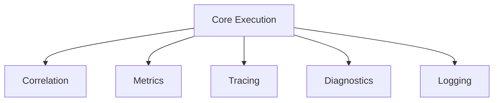

Observability is intended to describe system behavior rather than become a correctness dependency.

---

## Configuration

Configuration follows a layered pipeline:


Runtime updates reuse the same preparation pipeline and only publish a new immutable configuration snapshot after preparation succeeds.

The configuration subsystem includes:

- environment access;
- loading;
- parsing;
- validation;
- semantic validation hooks;
- resolution/defaults;
- secret references and secret values;
- immutable snapshots;
- configuration updates.

The goal is to avoid exposing partially prepared configuration to running components.

---

## Health and Readiness

Health is represented as information about runtime state rather than as the routing authority.

Core distinguishes:

- liveness;
- readiness;
- dependency health;
- capability health;
- aggregate health reports.

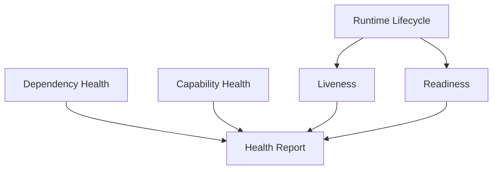

The Control Plane can consume observations such as health and readiness when determining eligibility, but health itself does not become a second routing authority.

---

## Error and Logging Systems

### Error System

The Error System owns:

- validated error definitions;
- error codes;
- owners;
- error classes;
- severity;
- an in-process catalog;
- runtime error occurrences;
- error references;
- diagnostic details.

Error and logging remain separate systems.

### Logging System

Logging provides:

- structured log events;
- log levels and event types;
- logging context;
- metadata;
- sinks;
- logging instances;
- dispatch.

A log event can reference technical status, errors, metadata, and artifact information without making the logging system the owner of those concepts.

---

## Project Structure

The repository is a Rust library crate.

```text
.
├── Cargo.toml
├── Cargo.lock
├── README.md
├── scope.md
├── src/
│   ├── artifact/
│   ├── capability/
│   ├── client/
│   ├── config/
│   ├── contracts/
│   ├── control_plane/
│   ├── error/
│   ├── events/
│   ├── health/
│   ├── idempotency/
│   ├── identity/
│   ├── logging/
│   ├── middleware/
│   ├── observability/
│   ├── operation/
│   ├── provenance/
│   ├── retry/
│   ├── runtime/
│   ├── security/
│   ├── server/
│   ├── streaming/
│   ├── transport/
│   ├── lib.rs
│   ├── prelude.rs
│   └── status.rs
└── tests/
    ├── artifact.rs
    ├── capability.rs
    ├── communication.rs
    ├── concurrency.rs
    ├── configuration.rs
    ├── conformance.rs
    ├── context.rs
    ├── contracts.rs
    ├── control_plane.rs
    ├── core_pipeline.rs
    ├── errors.rs
    ├── events.rs
    ├── foundations.rs
    ├── health.rs
    ├── idempotency.rs
    ├── lifecycle.rs
    ├── logging.rs
    ├── observability.rs
    ├── phase11_end_to_end.rs
    ├── phase12_end_to_end.rs
    ├── phase15_end_to_end.rs
    ├── provenance.rs
    ├── registration.rs
    ├── retry.rs
    ├── routing.rs
    ├── runtime.rs
    ├── security.rs
    ├── streaming.rs
    └── tasks.rs
```

The public library target is named `nizaam_core`, while the Cargo package remains `core`.

---

## Testing

Testing is part of the project throughout development. It is not deferred until the final phase.

The repository currently contains:

- unit tests inside the implementation modules;
- integration tests under `tests/`;
- subsystem-specific tests;
- end-to-end tests for completed phases;
- Control Plane tests;
- conformance-oriented tests.

The current source snapshot contains approximately:

- **1,576** unit tests inside `src/`;
- **410** integration tests under `tests/`;
- **1,986** test functions in total.

These counts describe the checked-in test sources and are not a claim that every test currently passes on every machine.

## Architecture Principles

The following principles are especially important when extending Core.

### 1. Core stays domain agnostic

Do not put Quran, Hadith, Arabic, Fiqh, search, or other engine-specific business logic into Core.

### 2. One responsibility per subsystem

Examples:

- Transport transports.
- Runtime executes.
- Retry decides whether another attempt is safe.
- Control Plane coordinates communication.
- Security authenticates and authorizes.
- Health reports health.
- Observability reports observations.
- Events publish internal events.

### 3. Do not create duplicate infrastructure

Existing mechanisms should be reused instead of creating parallel systems for:

- transport;
- retry;
- security;
- tracing;
- deadlines;
- cancellation;
- health;
- compatibility;
- identity.

### 4. Keep identities distinct

Do not merge concepts such as:

```text
OperationId != AttemptId
EngineId != EngineInstanceId
MessageId != EventId
PlanId != OperationId
ArtifactId != IdempotencyKey
```

### 5. Preserve immutable decisions

Once a routing or coordination decision has been produced, later mutable state should not silently rewrite that decision.

### 6. Keep planning separate from execution

Plans and dependencies describe coordination requirements.

The runtime executes.

The Control Plane coordinates.

Neither should silently become the other.

### 7. Prefer deterministic behavior

When the same valid inputs describe the same decision, the result should be deterministic wherever the architecture requires it.

### 8. Keep tests close to the public contract

Conformance tests should primarily verify stable/public behavior rather than depending unnecessarily on private implementation layout.

### 9. Fail explicitly

Invalid lifecycle transitions, invalid frames, incompatible contracts, unavailable destinations, exhausted resources, and other boundary violations should be represented explicitly rather than silently ignored.

---

## End-to-End Architecture View

The following diagram summarizes how the major systems fit together.

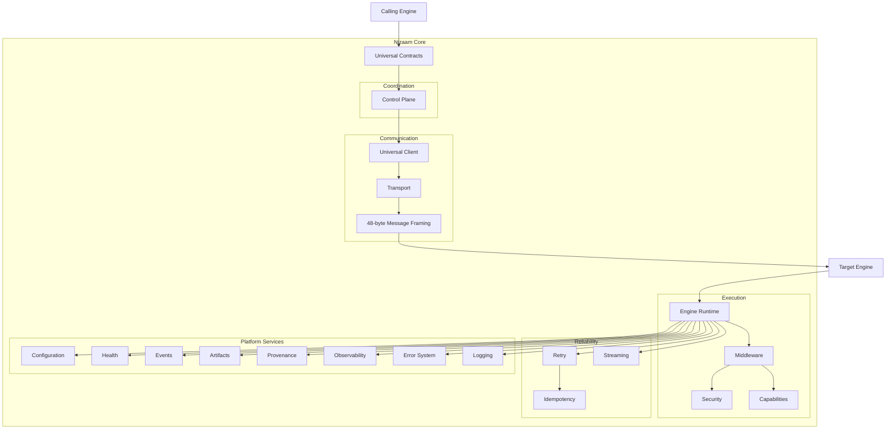

The diagram is conceptual rather than a statement that every subsystem calls every other subsystem directly. The actual implementation preserves narrower ownership boundaries.

---

## Compatibility and Evolution

Core is designed so that engines can evolve independently while sharing stable platform contracts.

Important compatibility boundaries include:

- contract versions;
- payload descriptors;
- universal envelopes;
- explicit identity types;
- transport framing version;
- capability advertisements;
- engine registration metadata;
- routing decisions;
- configuration snapshots.

Changes should preserve existing contracts unless a deliberate compatibility decision is made.

---

## Current Status

The implementation currently contains the Core foundation through the completed Control Plane work.

The major implementation phases represented in the repository are:

| Phase | Area | Status |
| ---: | --- | --- |
| 0 | Workspace and library foundation | Implemented |
| 1 | Identity, result primitives, operation model | Implemented |
| 2 | Universal Contract Layer | Implemented |
| 3 | Error System | Implemented |
| 4 | Logging System | Implemented |
| 5 | Context execution infrastructure | Implemented |
| 6 | Capability System | Implemented |
| 7 | Transport and universal client/server | Implemented |
| 8 | Engine Runtime | Implemented |
| 9 | Middleware and Security | Implemented |
| 10 | Artifact and Provenance | Implemented |
| 11 | Observability, Health, Configuration | Implemented |
| 12 | Streaming, Concurrency, Background Tasks | Implemented |
| 13 | Retry and Idempotency | Implemented |
| 14 | Internal Events | Implemented |
| 15 | Control Plane | Implemented |
| 16 | Testing and Conformance | In progress |

Phase 16 focuses on final verification and hardening rather than introducing another production subsystem.

---

## Getting Started

### Requirements

The project is a Rust library using the Rust 2024 edition.

The repository declares:

```text
Rust 1.96+
```

### Build

```bash
cargo build
```

### Run the test suite

```bash
cargo test
```

### Run tests without changing the working tree

```bash
cargo test --locked
```

### Check the project

```bash
cargo check
```

Because Nizaam Core is a library crate, there is no `src/main.rs` binary entry point.

The library target is:

```text
nizaam_core
```

---

## Development Guidelines

When adding functionality:

1. Identify the correct existing subsystem.
2. Check whether Core already provides the required mechanism.
3. Preserve the established ownership boundary.
4. Prefer existing identity, error, context, lifecycle, and compatibility types.
5. Add focused unit tests for local behavior.
6. Add integration/conformance tests for public behavior.
7. Avoid introducing domain semantics into Core.
8. Avoid duplicate infrastructure.
9. Keep architectural decisions explicit.
10. For Phase 16 work, keep production-code changes out of `src/` unless a genuine implementation flaw is independently identified.

---

## License

Nizaam Core is licensed under the [MIT License](LICENSE).

Copyright (c) 2026 Sharique Chaudhary.
